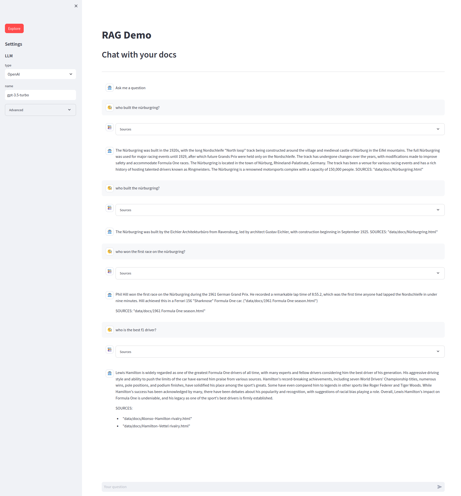
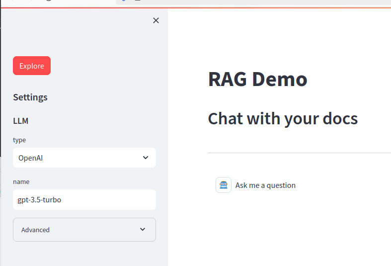
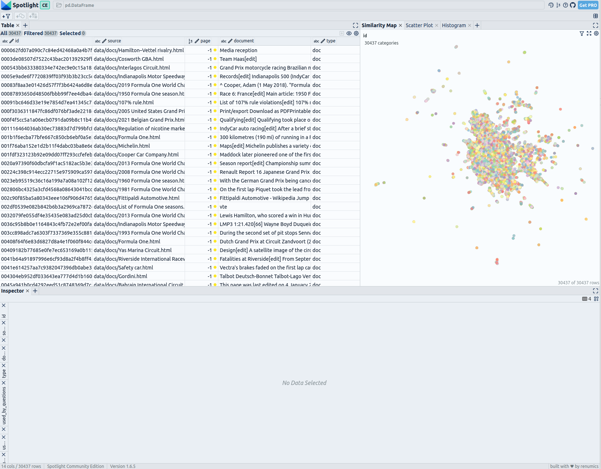
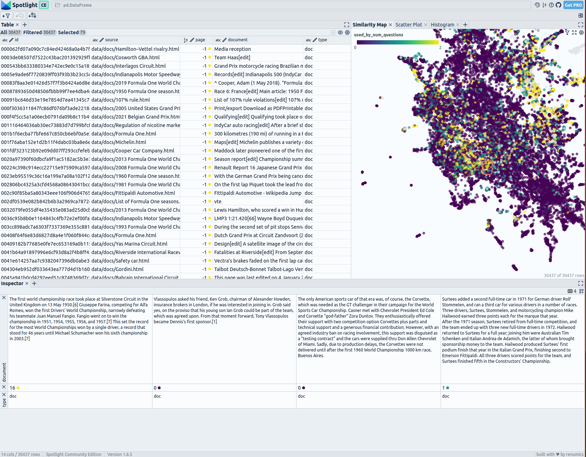

# 🤖 Renumics RAG: Explore and Visualize RAG Data

Retrieval-augmented generation assistant demo using [LangChain](https://github.com/langchain-ai/langchain) and [Streamlit](https://github.com/streamlit/streamlit).

## 🛠️ Installation

Setup a virtual environment in the project directory:

```shell
python3.8 -m venv .venv
source .venv/bin/activate  # Linux/MacOS
# .\.venv\Scripts\activate.bat  # Windows CMD
# .\.venv\Scripts\activate.ps1  # PowerShell
pip install -IU pip setuptools wheel
```

Install the RAG demo package and some extra dependencies:

```shell
# For GPU support
pip install renumics-rag[all]@git+https://github.com/Renumics/renumics-rag.git torch torchvision sentence-transformers accelerate
# For CPU support
# pip install renumics-rag[all]@git+https://github.com/Renumics/renumics-rag.git torch torchvision sentence-transformers accelerate --extra-index-url https://download.pytorch.org/whl/cpu
```

## ⚒️ Local Setup

If you intend to edit, not simply use, this project, clone the entire repository:

```shell
git clone git@github.com:Renumics/renumics-rag.git
```

Then install it in editable mode.

### Via `pip`

Setup virtual environment in the project folder:

```shell
python3.8 -m venv .venv
source .venv/bin/activate  # Linux/MacOS
# .\.venv\Scripts\activate.bat  # Windows CMD
# .\.venv\Scripts\activate.ps1  # PowerShell
pip install -IU pip setuptools wheel
```

Install the RAG demo package and some extra dependencies:

```shell
pip install -e .[all]
# For GPU support
pip install pandas torch torchvision sentence-transformers accelerate
# For CPU support
# pip install pandas torch torchvision sentence-transformers accelerate --extra-index-url https://download.pytorch.org/whl/cpu
```

### Via `uv`

Install the RAG demo and some extra dependencies:

```shell
uv install --all-extras --no-extra hf-cu130 # CPU support
uv install --all-extras --no-extra hf-cpu # GPU support
```

> Note: If you have [Direnv](https://direnv.net/) installed, you can avoid prefixing python commands with `uv run` after executing `direnv allow` in the project directory. It will activate environment each time you enter the project directory.

### ⚙️ Configuration

If you plan to use OpenAI models, create a `.env` file with the following content:

```bash
OPENAI_API_KEY="Your OpenAI API key"
```

If you plan to use OpenAI models via Azure, create `.env` with the following content:

```shell
OPENAI_API_TYPE="azure"  # optional
OPENAI_API_VERSION="2023-08-01-preview"
AZURE_OPENAI_API_KEY="Your Azure OpenAI API key"
AZURE_OPENAI_ENDPOINT="Your Azure OpenAI endpoint"
```

If you are using Hugging Face models, a .env file is not necessary.

You can configure the embeddings model, retriever and the LLM in the config file [settings file](./settings.yaml).

You can adapt it without cloning the repository by setting up an environment variable `RAG_SETTINGS` pointing to your local config file. You can also configure it from the GUI during the question and answering sessions. But it's important to choose the desired embeddings model because the indexing is done beforehand.

## 🚀 Usage: Indexing

You can skip this section [download the demo database with embeddings of a Formula One Dataset](https://spotlightpublic.blob.core.windows.net/docs-data/rag_demo/docs-db.zip). This dataset is based on articles from Wikipedia and is licensed under the Creative Commons Attribution-ShareAlike License. The original articles and a list of authors can be found on the respective Wikipedia pages.
To use your own data create a new data/docs directory within the project and place your documents in there (recursive directories are supported).

> Note: at the moment, only HTML files can be indexed but it can be adjusted in the [create-db](assistant/cli/create_db.py) script, this requires the [⚒️ Local Setup](#⚒️-local-setup)

Begin the process by indexing your documents. Execute the following command:

```shell
create-db
```

This will create a `db-docs` directory within the project consisting of indexed documents. To index additional documents, use the `--exist-ok` and `--on-match` flags (refer to `create-db --help` for more information).

## 🚀 Usage: Questioning

Now, you can leverage the indexed documents to answer questions.

To only retrieve relevant documents via command line interface:

```shell
retrieve "Your question here"
# QUESTION: ...
# SOURCES: ...
```

To answer a question based on the indexed documents:

```shell
answer "Your question here"
# QUESTION: ...
# ANSWER: ...
# SOURCES: ...
```

To start a web application (See `app --help` for available application options):

```shell
app
```

This will open a new browser window:


You can enter your questions to get them answered by the RAG System. Each answer contains an expandable 'Sources' section that includes the text and filename for each snippet used to generate the answer. 
The Settings section on the left allows you to choose different LLMs from OpenAI or Hugging Face. In the advanced settings, you can adjust the retrieval settings like the choice of relevance score function, the number of retrieved snippets, and search type. You can also change the embeddings model. 
Note: Changing the embeddings model requires creating a new database with the new embeddings.

## 🔎 Interactive exploration

After submitting some questions, you can explore them using [Renumics Spotlight](https://github.com/Renumics/spotlight) by clicking the red explore button on the left:


It will open a new browser tab:


You can see a table of all questions and all document snippets on the top left side. Using the 'visible columns' button, you can control which columns are shown in the table.

On the right side is the similarity map; it shows the questions and documents based on the embeddings. You can customize it by clicking the settings button and apply coloring by 'used_by_num_question' to color the snippets by the number of questions where the retriever loaded this snippet.

You can select snippets in the similarity map or in the table to display them in the details view at the bottom. To customize the detail view, you can remove rows by clicking the 'x' and add views with the 'Add View' button. A good setup here is to display the document, used_by_num_question and type.



Exploring the exemplary F1 Dataset and over 500 questions from our [RAG evaluation article](https://towardsdatascience.com/visualize-your-rag-data-evaluate-your-retrieval-augmented-generation-system-with-ragas-fc2486308557) can reveal interesting clusters. Document clusters of race statistics, racing techniques and strategies, and team details are frequently referenced by at least one question. Others, like Television Rights or specific race track details, are retrieved less often.

## 🔎 Tutorials and References

To learn more about visulization for RAG, check out our articles:

- [ITNext: Visualize your RAG Data - EDA for Retrieval-Augmented Generation](https://itnext.io/visualize-your-rag-data-eda-for-retrieval-augmented-generation-0701ee98768f): visualization of single questions, answers, and related documents shows large potential for RAG. Dimensionality reduction techniques can make the embedding space accessible for users and developers
  

- [Towards Data Science: Visualize your RAG Data - Evaluate your Retrieval-Augmented Generation System with Ragas](https://towardsdatascience.com/visualize-your-rag-data-evaluate-your-retrieval-augmented-generation-system-with-ragas-fc2486308557): Utilizing UMAP-based visualization offers an interesting approach to delve deeper than just analyzing global metrics for evaluations in RAG.
  ![Animation of the iterations of a UMAP [3] dimensionality reduction for Wikipedia Formula One articles in the embedding space with manually labeled clusters](assets/img/rag2_ani.gif)
